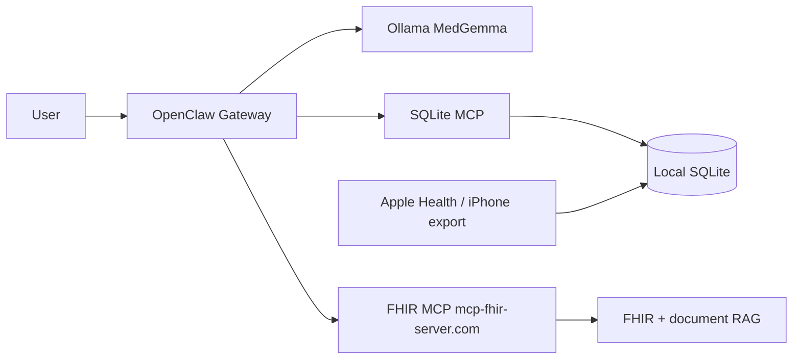

# OpenClaw Health Assistant — Setup & Usage Guide

A **local-first personal health companion** for macOS: **OpenClaw** orchestrates tools, **MedGemma** (via **Ollama**) reasons over your data, and **SQLite** holds a MyWellWallet-compatible cache of FHIR bundles and Apple Health metrics.

> **Medical disclaimer:** Research prototype only—not for diagnosis or treatment decisions.

---

## Contributors

| Area | Lead |
| --- | --- |
| Project management, OpenClaw + MedGemma, Apple Health | **Mahesh Balan** |
| SQLite schema, DB setup & testing, SQLite MCP server | **Brandon Medina** |
| MCP connections (OpenClaw ↔ SQLite MCP ↔ FHIR MCP) | **Leonard Bryant** |

See [CONTRIBUTORS.md](./CONTRIBUTORS.md). Repo overview (ZeroClaw vs OpenClaw): [../README.md](../README.md).

---

## What you are building



1. **Sync once:** Apple Health (via iPhone export) and FHIR (via MCP) populate **local SQLite**.
2. **Ask anytime:** OpenClaw uses **SQLite MCP** to retrieve context, then **MedGemma** answers grounded in **your** rows—not frontier cloud models.
3. **Identity once:** Your **name, DOB, and FHIR API key** live in **`config/.env`** (gitignored), so the agent does not keep re-prompting for authentication.

---

## Prerequisites

| Requirement | Notes |
| --- | --- |
| **macOS** | Apple Silicon or Intel |
| **Node.js 24+** | OpenClaw CLI requires it (`nvm install 24 && nvm use 24`) |
| **Ollama** | `brew install ollama` · `brew services start ollama` |
| **Python 3.11+** | For SQLite MCP venv |
| **SQLite CLI** | `sqlite3` (Xcode CLT or Homebrew) |
| **RAM** | 8 GB+ for MedGemma 4B; **64 GB** (e.g. iMac Pro) enables **`medgemma:27b`** or **Qwen ~4B** experiments |

---

## 1. Clone and configure secrets (local only)

```bash
git clone https://github.com/CGU-AI4Humanity/openclaw_health_wallet.git
cd openclaw_health_wallet/Openclaw_Health_Assistant
cp config/.env.example config/.env
```

Edit **`config/.env`** (never committed—listed in [`.gitignore`](./.gitignore)):

| Variable | Purpose |
| --- | --- |
| `FHIR_MCP_API_KEY` | API key for the [FHIR MCP Server](https://github.com/maheshbalan/fhir-mcp-server) hosted at [mcp-fhir-server.com](https://mcp-fhir-server.com/) (`X-API-Key` header) |
| `FHIR_PATIENT_FIRST_NAME` | Your given name for FHIR patient search |
| `FHIR_PATIENT_LAST_NAME` | Your family name for FHIR patient search |
| `FHIR_PATIENT_DOB` | ISO date `YYYY-MM-DD` for patient matching |
| `MYWELLWALLET_DB_PATH` | Local SQLite path (default `~/.openclaw-health-assistant/mywellwallet.db`) |
| `APPLE_HEALTH_PHONE_DB_PATH` | Optional path to iPhone MyWellWallet export for health tables |
| `OLLAMA_MEDGEMMA_MODEL` | Default `medgemma:4b`; change after pulling larger models |

**Also gitignored:** `*.db`, `apple-health-bridge/inbox/*.json`, OpenClaw secrets under `~/.openclaw/`. Do not commit PHI or keys.

OpenClaw may store MCP headers in `~/.openclaw/openclaw.json` after wiring; prefer env-backed secrets in production. Doctor may warn if a literal API key appears in config—rotate keys if a machine was shared.

---

## 2. Install OpenClaw

```bash
export NVM_DIR="$HOME/.nvm" && source "$NVM_DIR/nvm.sh"
nvm install 24 && nvm use 24
curl -fsSL https://openclaw.ai/install.sh | bash
openclaw onboard --install-daemon   # or use install script only
```

Docs: [OpenClaw install](https://docs.openclaw.ai/install/) · [Ollama provider](https://docs.openclaw.ai/providers/ollama) (use native `http://127.0.0.1:11434`, **not** `/v1`).

Ensure the gateway sees Ollama:

```bash
mkdir -p ~/.openclaw
echo 'OLLAMA_API_KEY=ollama-local' >> ~/.openclaw/.env
```

---

## 3. Ollama + MedGemma

```bash
brew services start ollama
ollama pull medgemma:4b
```

**Optional (64 GB RAM):**

```bash
ollama pull medgemma:27b
# or: ollama pull qwen3:4b
```

Set `OLLAMA_MEDGEMMA_MODEL` in `config/.env`, then:

```bash
./scripts/configure_medgemma.sh
```

This patches `~/.openclaw/openclaw.json` so the default agent model is **`ollama/medgemma:4b`** (edit [config/openclaw.medgemma.patch.json5](./config/openclaw.medgemma.patch.json5) for other model ids).

---

## 4. SQLite database (Brandon Medina)

Empty schema:

```bash
./scripts/init_db.sh
```

Populate from iPhone MyWellWallet export (recommended for testing—**PHI**, keep local):

```bash
./scripts/copy_fixture_db.sh /path/to/mywellwallet.db
```

Validate:

```bash
./scripts/test_local_stack.sh
```

Schema: [db/schema.sql](./db/schema.sql) · [db/SQLITE_SCHEMA.md](./db/SQLITE_SCHEMA.md) · [db/README.md](./db/README.md).

---

## 5. SQLite MCP server

```bash
./scripts/setup_sqlite_mcp_venv.sh
```

Uses **`mcp[cli]==1.12.4`** (FastMCP). Tools include: `sqlite_health`, `list_fhir_patients`, `get_fhir_patient_bundle`, `search_fhir_resources`, `execute_read_query`, `upsert_fhir_patient`, `upsert_fhir_resource`, Apple Health tools below.

---

## 6. Wire MCP servers in OpenClaw (Leonard Bryant)

```bash
source config/.env   # or export vars manually
./scripts/wire_mcp_servers.sh
```

This registers:

| Server | Transport | Endpoint |
| --- | --- | --- |
| `mywellwallet-sqlite` | stdio | Python `sqlite-mcp/server.py` |
| `fhir-remote` | streamable-http | `https://mcp-fhir-server.com/mcp` + `X-API-Key` |

Verify:

```bash
nvm use 24
openclaw mcp doctor mywellwallet-sqlite --probe
openclaw mcp doctor fhir-remote --probe
openclaw mcp status --verbose
```

Details: [docs/MCP_CONNECTIONS.md](./docs/MCP_CONNECTIONS.md).

### About the FHIR MCP Server

The **[FHIR MCP Server](https://github.com/maheshbalan/fhir-mcp-server)** provides MCP tools for **FHIR resource CRUD**, **document ingestion & semantic search (RAG)**, **LOINC** terminology, and **API-key authentication** on the hosted service **[mcp-fhir-server.com](https://mcp-fhir-server.com/)**—the same gateway used by the **[MyWellWallet](https://github.com/maheshbalan/myWellWallet)** iPhone app. OpenClaw calls it over **Streamable HTTP**; session and tool semantics match the mobile MCP client.

---

## 7. Apple Health (Mahesh Balan)

Full HealthKit on macOS is limited; this project uses **safe, local** paths:

### A. iPhone MyWellWallet export (recommended)

Export the app database from iPhone to your Mac (see [MyWellWallet](https://github.com/maheshbalan/myWellWallet) `fixtures/test_database_export/README.md`). Set `APPLE_HEALTH_PHONE_DB_PATH` in `config/.env`.

In OpenClaw, call MCP tool **`sync_apple_health_from_phone_database`** (or use the prompt in [docs/FIRST_RUN_PROMPTS.md](./docs/FIRST_RUN_PROMPTS.md)).

### B. JSON inbox

Place a file in `apple-health-bridge/inbox/` (see [inbox/README.md](./apple-health-bridge/inbox/README.md)), then call **`import_apple_health_json`**.

### MCP tools

| Tool | Description |
| --- | --- |
| `get_apple_health_sync_status` | Reads `health_sync_settings` |
| `sync_apple_health_from_phone_database` | Copies `health_*` tables from phone SQLite |
| `import_apple_health_json` | Imports structured JSON export |
| `health_metrics_summary` | Row counts per health table |

Apple permissions and exports stay **on your machine**; nothing is committed to git.

---

## 8. One-command install (macOS)

After `config/.env` is filled in:

```bash
./scripts/install_local_stack.sh
```

Runs venv, DB, MedGemma patch, MCP wire, and smoke tests.

---

## 9. First conversation — connect data sources (one at a time)

Start the UI:

```bash
nvm use 24
openclaw tui
```

Use the copy-paste prompts in **[docs/FIRST_RUN_PROMPTS.md](./docs/FIRST_RUN_PROMPTS.md)**:

1. **Apple Health** → SQLite sync  
2. **FHIR MCP** → fetch using **first name, last name, DOB** from `config/.env` and upsert into SQLite  
3. **Ongoing Q&A** → SQLite MCP context + MedGemma answers  

---

## 10. How answers use SQLite context

For routine questions, OpenClaw should:

1. Call **mywellwallet-sqlite** (`search_fhir_resources`, `execute_read_query` on `health_*`, etc.).
2. Pass retrieved JSON/text as context to **MedGemma**.
3. Optionally refresh from **fhir-remote** if the user asks for “latest from server.”

You do **not** need to repeat API key or Apple login each session if `config/.env` and prior sync steps are complete.

---

## Repository layout

```text
Openclaw_Health_Assistant/
├── README.md                    # this guide
├── CONTRIBUTORS.md
├── config/
│   ├── .env.example             # template — copy to .env (gitignored)
│   ├── openclaw.example.json5
│   └── openclaw.medgemma.patch.json5
├── db/                          # Brandon — schema & docs
├── sqlite-mcp/                  # Brandon — MCP server
├── apple-health-bridge/         # Mahesh — Health sync helpers
├── docs/
│   ├── MCP_CONNECTIONS.md       # Leonard
│   ├── FIRST_RUN_PROMPTS.md
│   ├── SETUP.md
│   └── ARCHITECTURE.md
└── scripts/
    ├── install_local_stack.sh
    ├── configure_medgemma.sh
    ├── wire_mcp_servers.sh
    └── test_local_stack.sh
```

---

## Troubleshooting

| Issue | Fix |
| --- | --- |
| `openclaw`: Node version | `nvm use 24` |
| Ollama not running | `brew services start ollama` |
| SQLite MCP probe fails | Re-run `setup_sqlite_mcp_venv.sh`; check `MYWELLWALLET_DB_PATH` in MCP env |
| FHIR MCP 401 | Set `FHIR_MCP_API_KEY` in `config/.env`; re-run `wire_mcp_servers.sh` |
| Wrong patient in FHIR | Fix `FHIR_PATIENT_*` in `config/.env` |
| Empty health tables | Run Apple Health sync prompt or `copy_fixture_db.sh` |

---

## Project lead

**Mahesh Balan** — OpenClaw Health Assistant integration, CGU IST 362 / DTech coordination.
