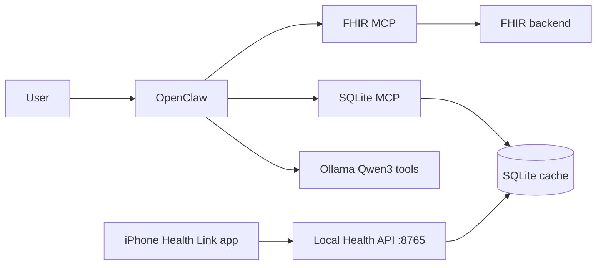

# OpenClaw Health Assistant — Step-by-Step Setup Guide

A **local-first personal health companion** on macOS: **OpenClaw** calls MCP tools, **Qwen3** on **Ollama** orchestrates tool use, and answers using **your** data in **SQLite**—no frontier cloud model required. Optional **MedGemma** is available for non-tool chat only (Ollama does not expose tool calling on `medgemma:4b`).

> **Medical disclaimer:** Research software only—not for diagnosis or treatment decisions.

**Contributors:** Mahesh Balan (integration, Apple Health, PM) · Brandon Medina (SQLite + SQLite MCP) · Leonard Bryant (OpenClaw MCP wiring). See [CONTRIBUTORS.md](./CONTRIBUTORS.md). Monorepo overview: [../README.md](../README.md).

---

## Before you start (checklist)

You will complete these **in order**:

| Step | What | Ollama / OpenClaw chat? |
| --- | --- | --- |
| [1](#step-1-clone-the-repository) | Clone repo | No |
| [2](#step-2-install-system-software) | Node 24, Python, Ollama (install only), OpenClaw CLI | No |
| [3](#step-3-create-local-config-never-commit-secrets) | `config/.env` — FHIR key + your name/DOB | No |
| [4](#step-4-connect-to-the-fhir-mcp-server) | FHIR MCP admin key + patient identity | No |
| [5](#step-5-connect-apple-health-qr--api) | iPhone pairing (QR) → Health API → SQLite | No |
| [6](#step-6-local-sqlite-database) | Initialize DB | No |
| [7](#step-7-sqlite-mcp-server) | Python venv + tools | No |
| [8](#step-8-register-mcp-servers-in-openclaw) | Wire SQLite + FHIR MCP | No |
| [9](#step-9-start-ollama-and-local-models) | Pull **Qwen3** (MCP tools) + optional MedGemma | Start Ollama |
| [10](#step-10-start-openclaw-and-sync-data-once) | `openclaw chat` + one-time sync prompts | **Yes** |
| [11](#step-11-everyday-prompts-sqlite-context--local-llm) | Grounded Q&A with MCP | **Yes** |

Do **not** skip to Step 9 until Steps 3–8 are done—otherwise MCP tools and credentials will be missing.

---

## Architecture (what you are wiring)



- **[FHIR MCP Server](https://github.com/maheshbalan/fhir-mcp-server)** — hosted API at [mcp-fhir-server.com](https://mcp-fhir-server.com/).
- **[MyWellWallet](https://github.com/maheshbalan/myWellWallet)** — related iOS health wallet research app (FHIR); **not required** for Apple Health pairing in this track.
- **iPhone “Health Link” companion** (thin app) — scans QR, reads HealthKit, POSTs to Mac — see [docs/SETUP_WIZARD_AND_APPLE_HEALTH.md](./docs/SETUP_WIZARD_AND_APPLE_HEALTH.md).

---

## Recommended path: Setup Wizard

The Mac setup assistant walks through install verification, FHIR credentials, QR-based Apple Health pairing, and resumable progress:

```bash
./scripts/run_setup_wizard.sh
```

Design and iPhone companion plan: **[docs/SETUP_WIZARD_AND_APPLE_HEALTH.md](./docs/SETUP_WIZARD_AND_APPLE_HEALTH.md)**.

Manual steps below match the same order if you prefer the terminal.

## Step 1 — Clone the repository

```bash
git clone https://github.com/CGU-AI4Humanity/openclaw_health_wallet.git
cd openclaw_health_wallet/Openclaw_Health_Assistant
```

---

## Step 2 — Install system software

Install tools only—**do not** start chatting yet.

### 2a. Node.js 24 (required for OpenClaw)

```bash
export NVM_DIR="$HOME/.nvm" && source "$NVM_DIR/nvm.sh"
nvm install 24 && nvm use 24
node -v   # should be v24.x
```

### 2b. OpenClaw CLI

```bash
npm install -g openclaw@latest --allow-scripts openclaw
openclaw --version
```

Optional onboarding (gateway daemon):

```bash
curl -fsSL https://openclaw.ai/install.sh | bash
# or: openclaw onboard --install-daemon
```

Docs: [OpenClaw install](https://docs.openclaw.ai/install/) · [Ollama provider](https://docs.openclaw.ai/providers/ollama) (native URL `http://127.0.0.1:11434` — **never** `/v1`).

### 2c. Ollama (install + service, pull model in Step 9)

```bash
brew install ollama
brew services start ollama
```

### 2d. Python + SQLite

- Python **3.11+** (macOS or Homebrew).
- `sqlite3` (Xcode Command Line Tools).

### 2e. Gateway env for Ollama discovery

```bash
mkdir -p ~/.openclaw
grep -q OLLAMA_API_KEY ~/.openclaw/.env 2>/dev/null || echo 'OLLAMA_API_KEY=ollama-local' >> ~/.openclaw/.env
```

---

## Step 3 — Create local config (never commit secrets)

```bash
cp config/.env.example config/.env
chmod 600 config/.env
```

**Important:** `config/.env` is in [`.gitignore`](./.gitignore). **Never** put API keys, DOB, or health data **in the Git repository**. Admins send keys to you privately; you paste them only into **`config/.env` on your Mac**.

| Variable | You fill in | Purpose |
| --- | --- | --- |
| `FHIR_MCP_API_KEY` | From FHIR MCP admin (Step 4) | Authenticates to hosted FHIR MCP |
| `FHIR_PATIENT_FIRST_NAME` | Your legal first name | Patient search on FHIR server |
| `FHIR_PATIENT_LAST_NAME` | Your legal last name | Patient search |
| `FHIR_PATIENT_DOB` | `YYYY-MM-DD` | Patient search |
| `OPENCLAW_HEALTH_DB_PATH` | Usually default | Local SQLite file |
| `FHIR_MCP_BASE_URL` | Usually `https://mcp-fhir-server.com` | API host |
| `APPLE_HEALTH_API_BASE_URL` | After QR pairing | Mac local sync API |
| `APPLE_HEALTH_DEVICE_TOKEN` | After QR pairing | Pairing secret (local `.env` only) |
| `OLLAMA_MEDGEMMA_MODEL` | e.g. `medgemma:4b` | Optional; plain chat only (no MCP tools on Ollama) |
| `OLLAMA_TOOLS_MODEL` | e.g. `qwen3:4b` | Default agent for MCP / Steps 10–11 |

---

## Step 4 — Connect to the FHIR MCP Server

### 4a. Request an API key (admin)

1. Contact the **FHIR MCP Server administrator** for your organization or study (see [fhir-mcp-server](https://github.com/maheshbalan/fhir-mcp-server) documentation).
2. Admin creates an **`X-API-Key`** for you on the hosted service ([mcp-fhir-server.com](https://mcp-fhir-server.com/)).
3. Admin sends the key through a **private channel** (email, 1Password, etc.)—**not** via a public GitHub issue or commit.
4. You paste the key into **`config/.env`**:

   ```bash
   FHIR_MCP_API_KEY=your-key-here
   FHIR_PATIENT_FIRST_NAME=Jane
   FHIR_PATIENT_LAST_NAME=Doe
   FHIR_PATIENT_DOB=1990-06-15
   ```

These three patient fields are stored locally so OpenClaw **does not ask again every session**—the agent uses them when calling FHIR MCP tools to find **your** record.

### 4b. What the FHIR MCP connection does

OpenClaw talks to **`https://mcp-fhir-server.com/mcp`** over **Streamable HTTP** with header:

`X-API-Key: <FHIR_MCP_API_KEY>`

That is the same pattern as the [MyWellWallet](https://github.com/maheshbalan/myWellWallet) iOS app. Tools fetch FHIR resources (conditions, labs, meds, etc.) and document RAG when enabled on the server.

Actual MCP registration in OpenClaw happens in [Step 8](#step-8-register-mcp-servers-in-openclaw) after `config/.env` is complete.

---

## Step 5 — Connect Apple Health (QR + local API)

Apple Health is authorized on **iPhone**; metrics are sent to a **small HTTP API on your Mac** (no MyWellWallet export path).

### Option A — Setup Wizard (recommended)

```bash
./scripts/run_setup_wizard.sh
```

1. Open the **Apple Health** tab → **Start pairing + show QR**.
2. On iPhone, build & run **[Health Link](../../Health_Link_iOS/)** (`xcodegen generate` → Xcode → device) and scan the QR.
3. Grant **HealthKit** read access; the phone `POST`s JSON to `http://<your-mac>:8765/v1/health/sync` with header `X-Pairing-Token`.
4. Wizard writes `APPLE_HEALTH_API_BASE_URL` and `APPLE_HEALTH_DEVICE_TOKEN` to **`config/.env`** and loads **`health_*`** SQLite tables.

### Option B — Terminal QR only

```bash
./scripts/apple_health_pairing.sh   # prints QR if qrencode/qrcode installed
# In another terminal, keep pairing server running via the wizard or pairing_server.py
```

Optional **Mac HealthKit** direct ingestion may be added later for hosts that already sync Health data from iPhone.

Optional MCP tool **`import_apple_health_json`** supports file-based import from `apple-health-bridge/inbox/` for engineering use only—not the standard Apple Health path.

---

## Step 6 — Local SQLite database

Creates the local FHIR + Apple Health SQLite schema (Brandon Medina):

```bash
./scripts/init_db.sh
```

Default file: `~/.openclaw-health-assistant/openclaw_health.db` (override with `OPENCLAW_HEALTH_DB_PATH` in `config/.env`).

Optional: copy a populated test database for local QA (PHI—local only):

```bash
./scripts/copy_fixture_db.sh /path/to/test.sqlite3
```

Schema docs: [db/schema.sql](./db/schema.sql) · [db/SQLITE_SCHEMA.md](./db/SQLITE_SCHEMA.md).

---

## Step 7 — SQLite MCP server

This is a **local Python MCP server** (stdio) that exposes SQLite to OpenClaw—**no API key**; it reads `OPENCLAW_HEALTH_DB_PATH`.

```bash
./scripts/setup_sqlite_mcp_venv.sh
```

Main tools (Brandon Medina):

| Tool | Use |
| --- | --- |
| `sqlite_health` | DB path + table counts |
| `list_fhir_patients` / `get_fhir_patient_bundle` | Cached EHR |
| `search_fhir_resources` | Conditions, Observations, etc. |
| `execute_read_query` | Read-only SQL on `health_*` / FHIR tables |
| `upsert_fhir_patient` / `upsert_fhir_resource` | After FHIR MCP fetch |
| `get_apple_health_sync_status` | Pairing/sync metadata |
| `import_apple_health_json` | Optional file-based Apple Health import |

Requires **`mcp[cli]==1.12.4`** (installed by the script).

---

## Step 8 — Register MCP servers in OpenClaw

Leonard Bryant’s wiring script reads **`config/.env`** and registers both servers in `~/.openclaw/openclaw.json`.

```bash
cd /path/to/openclaw_health_wallet/Openclaw_Health_Assistant
export NVM_DIR="$HOME/.nvm" && source "$NVM_DIR/nvm.sh" && nvm use 24
set -a && source config/.env && set +a
./scripts/cleanup_mcp_servers.sh
```

Use **`cleanup_mcp_servers.sh`** (not only `wire_mcp_servers.sh`) if you previously registered **`mywellwallet-sqlite`** or see **duplicate SQLite MCP** entries in `openclaw mcp status --verbose`.

### Expected MCP status

You should see **at most two** servers:

| Name | Role |
| --- | --- |
| **`openclaw-health-sqlite`** | Local SQLite (`OPENCLAW_HEALTH_DB_PATH`) |
| **`fhir-remote`** | Hosted FHIR MCP (if `FHIR_MCP_API_KEY` is set) |

**Remove:** `mywellwallet-sqlite`, duplicate SQLite entries, or stale rows in `~/.openclaw/openclaw.json` → re-run **`./scripts/cleanup_mcp_servers.sh`**.

### What this configures

| OpenClaw name | Type | How it runs |
| --- | --- | --- |
| **`openclaw-health-sqlite`** | stdio | `sqlite-mcp/.venv/bin/python server.py` with env `OPENCLAW_HEALTH_DB_PATH=...` |
| **`fhir-remote`** | streamable-http | URL `{FHIR_MCP_BASE_URL}/mcp` + header `X-API-Key: {FHIR_MCP_API_KEY}` |

### Verify connections

```bash
openclaw mcp doctor openclaw-health-sqlite --probe
openclaw mcp doctor fhir-remote --probe
openclaw mcp status --verbose
```

Both probes should report **ok**. Status should list **only** the servers above.

Manual reference: [docs/MCP_CONNECTIONS.md](./docs/MCP_CONNECTIONS.md).

---

## Step 9 — Start Ollama and local models

Start **Ollama**, then configure **Qwen3** for **MCP tool calling** (required for Steps 10–11):

```bash
brew services start ollama
./scripts/configure_qwen_tools.sh
```

This pulls **`qwen3:4b`** (or `OLLAMA_TOOLS_MODEL` from `config/.env`) and sets the default agent to **`ollama/qwen3:4b`**.

Verify tool support:

```bash
ollama show qwen3:4b | grep -A3 Capabilities
# should include: tools
```

**Optional — MedGemma** (medical-tuned **text** only; **cannot** call MCP tools in Ollama today):

```bash
ollama pull medgemma:4b
./scripts/configure_medgemma.sh   # switches default to medgemma — re-run configure_qwen_tools.sh before MCP prompts
```

**64 GB RAM:** larger tags (e.g. `qwen3:8b`, `medgemma:27b`) if `ollama show` lists **`tools`** for that tag.

Quick Ollama check:

```bash
ollama list
curl -s http://127.0.0.1:11434/api/tags | head
```

---

## Step 10 — Start OpenClaw and sync data (once)

Use **local embedded chat** (no Gateway token required):

```bash
nvm use 24
openclaw chat
```

(`openclaw tui` without `--local` needs a running Gateway and `OPENCLAW_GATEWAY_TOKEN`; see [OpenClaw TUI docs](https://docs.openclaw.ai/cli/tui).)

Run **one prompt at a time** (copy from below; replace names/DOB with your `config/.env` values).

### Prompt A — Apple Health (after QR/API or optional file import)

```text
Use only openclaw-health-sqlite tools.

1. get_current_user → user_id
2. get_apple_health_sync_status for that user_id
3. If health_* tables are empty, tell me to complete Step 5 (Health Link QR pairing on Mac).
4. health_metrics_summary for that user_id
5. Summarize available steps, heart rate, glucose, BP, and lab row counts.

Medical disclaimer required.
```

### Prompt B — FHIR MCP → update SQLite cache

Uses **first name, last name, DOB from config/.env** (not from chat memory):

```text
Use fhir-remote MCP tools, then openclaw-health-sqlite to persist locally.

1. Find patient: first name "<FHIR_PATIENT_FIRST_NAME>", last name "<FHIR_PATIENT_LAST_NAME>",
   birth date "<FHIR_PATIENT_DOB>".
2. Fetch Patient, Condition, Observation, MedicationRequest, Immunization, Encounter as available.
3. upsert_fhir_patient and upsert_fhir_resource so SQLite matches the server.
4. sqlite_health and list_fhir_patients to confirm.

Do not ask me for API key or DOB again—they are already configured.
Medical disclaimer required.
```

More prompts: [docs/FIRST_RUN_PROMPTS.md](./docs/FIRST_RUN_PROMPTS.md).

---

## Step 11 — Everyday prompts (SQLite context → local LLM)

After Steps 10A/B, **routine questions should hit SQLite first** via MCP, then the model explains. Ensure **`configure_qwen_tools.sh`** was applied. Paste this **before** your question:

```text
You must use openclaw-health-sqlite before answering.

1. list_fhir_patients (if needed identify my patient_id)
2. search_fhir_resources and/or execute_read_query on health_* tables for data relevant to my question
3. Answer ONLY using retrieved rows plus general education—not guesses
4. If cache might be stale, offer once to refresh via fhir-remote (use configured patient name/DOB)

My question: <write your question here>

Include a medical disclaimer.
```

Example questions:

- “What conditions are in my cached FHIR data?”
- “Summarize my last 30 days of step counts from health_steps.”
- “Explain my latest lab results rows in plain language.”

---

## Optional — one script after `config/.env` is ready

```bash
./scripts/install_local_stack.sh
```

Runs Steps 6–9 automation (venv, DB, Qwen tool model, MCP cleanup/wire, smoke test). You still complete Steps 3–5 manually first.

---

## Troubleshooting

| Symptom | Fix |
| --- | --- |
| `openclaw` Node error | `nvm use 24` |
| SQLite MCP probe fails | `./scripts/setup_sqlite_mcp_venv.sh`; check `OPENCLAW_HEALTH_DB_PATH` |
| FHIR MCP 401 | Valid `FHIR_MCP_API_KEY`; re-run `wire_mcp_servers.sh` |
| Wrong patient | Fix `FHIR_PATIENT_*` in `config/.env` |
| Empty `health_*` tables | Complete Step 5 (Health Link QR pairing on Mac) |
| Duplicate / stale MCP in status | `./scripts/cleanup_mcp_servers.sh` then `openclaw mcp status --verbose` |
| Missing gateway auth token | Use **`openclaw chat`** (local mode), not plain `openclaw tui` |
| Model ignores tools | `configure_qwen_tools.sh`; confirm `ollama show qwen3:4b` lists **tools** |
| Raw JSON tool output | Ollama `baseUrl` must not use `/v1`; re-run `configure_qwen_tools.sh` |
| **`provider rejected the request schema or tool payload`** | Default model lacks Ollama **tools** (e.g. `medgemma:4b`). Run **`./scripts/configure_qwen_tools.sh`**, then **`openclaw chat`**. |

---

## Repository layout

```text
Openclaw_Health_Assistant/
├── README.md                 ← this guide
├── config/.env.example       ← copy to .env (gitignored)
├── db/                       ← SQLite schema (Brandon)
├── sqlite-mcp/               ← local MCP (Brandon)
├── apple-health-bridge/      ← Health API / sync (Mahesh)
├── docs/MCP_CONNECTIONS.md   ← MCP detail (Leonard)
└── scripts/                  ← install, wire, test, pairing
```

---

## Project lead

**Mahesh Balan** — OpenClaw Health Assistant integration, Claremont Graduate University Doctor of Technology program.
