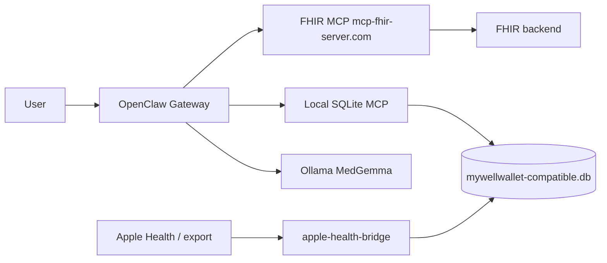

# OpenClaw Health Assistant

A **local-first personal health wallet** for macOS, built as CGU doctorate research alongside the MyWellWallet iOS app. OpenClaw orchestrates tools; **MedGemma** (via Ollama) provides medical-aware reasoning; data lives in **SQLite** with the same FHIR-oriented schema as MyWellWallet.

> **Medical disclaimer:** Research prototype only. Not for clinical diagnosis or treatment decisions.

## Goals

1. **OpenClaw + Ollama + MedGemma** — same agent stack as modern OpenClaw docs ([install](https://docs.openclaw.ai/install/), [Ollama provider](https://docs.openclaw.ai/providers/ollama)).
2. **Local SQLite** — `users`, `fhir_patients`, `fhir_resources`, `fetch_summaries`, and Apple Health mirror tables (see [db/schema.sql](./db/schema.sql)).
3. **Dual MCP**
   - **Local:** stdio/streamable HTTP MCP over SQLite (CRUD + safe SQL for the agent).
   - **Remote:** [FHIR MCP Server](https://mcp-fhir-server.com/) — same integration pattern as the iPhone app (`streamable-http`, session + API key).
4. **Apple Health** — ingest/sync wearable and clinical data into SQLite (bridge TBD; see [apple-health-bridge/README.md](./apple-health-bridge/README.md)).

## Architecture (target)



## Repository layout

```text
Openclaw_Health_Assistant/
├── README.md                 # this file
├── docs/
│   ├── ARCHITECTURE.md
│   └── SETUP.md              # OpenClaw, Ollama, MCP wiring
├── db/
│   ├── schema.sql            # MyWellWallet-compatible DDL
│   └── SQLITE_SCHEMA.md      # human-readable schema (from MyWellWallet)
├── config/
│   ├── .env.example
│   └── openclaw.example.json5
├── sqlite-mcp/               # local MCP server (implementation next)
├── apple-health-bridge/      # HealthKit / export → SQLite (implementation next)
└── scripts/
    └── init_db.sh
```

## Quick start (scaffold)

These steps prepare the environment; MCP and Apple Health code land in follow-up commits.

```bash
# 1. OpenClaw (see https://docs.openclaw.ai/install/)
curl -fsSL https://openclaw.ai/install.sh | bash
openclaw onboard --install-daemon

# 2. Ollama + MedGemma (https://ollama.com/library/medgemma)
brew install ollama   # or download from ollama.com
ollama pull medgemma:4b
export OLLAMA_API_KEY=ollama-local

# 3. Local database
cd Openclaw_Health_Assistant
cp config/.env.example config/.env   # edit paths and FHIR MCP key
./scripts/init_db.sh

# 4. Wire OpenClaw (after MCP servers exist)
# See docs/SETUP.md — openclaw mcp add ...
openclaw doctor
```

## Configuration

- Copy [config/.env.example](./config/.env.example) to `config/.env` (gitignored).
- Use [config/openclaw.example.json5](./config/openclaw.example.json5) as a template for MedGemma + MCP entries.
- **Never commit** `FHIR_MCP_API_KEY` or database files containing real health data.

## Status

| Item | Status |
| --- | --- |
| Repo layout + schema parity with MyWellWallet | Done (scaffold) |
| OpenClaw + MedGemma setup docs | Done (scaffold) |
| Local SQLite MCP server | Planned |
| Remote FHIR MCP (mcp-fhir-server.com) | Planned |
| Apple Health bridge | Planned |

## Author

**Mahesh Balan** — OpenClaw health wallet track, CGU DTech / IST 362.
