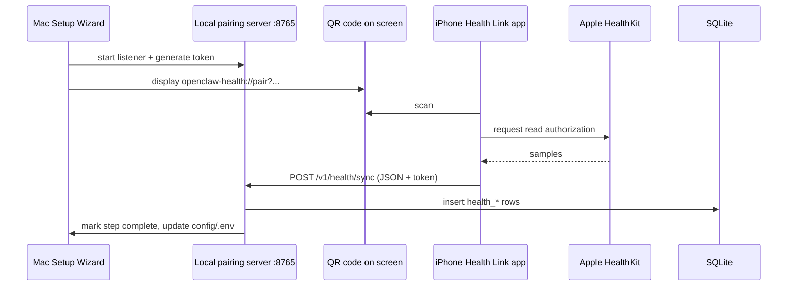

# Setup Wizard & Apple Health — Design (Mahesh Balan)

Goals for **class demo** and **student self-service**:

1. One **Mac app** (or wizard) that shows **what is done / what is next**.
2. **FHIR MCP** — form for API key + first name + last name + DOB → writes **`config/.env`** (never Git).
3. **Apple Health** — **no MyWellWallet SQLite export** on the happy path; **QR on Mac** → **iPhone authorizes HealthKit** → data hits a **local API on the Mac** → SQLite.
4. After wizard completes, student runs **Ollama + OpenClaw** and chats with **SQLite-grounded MedGemma**.

---

## Why there is no “Apple Health REST API” on the web

Apple does not offer a public cloud API for third-party apps to read HealthKit. Supported patterns:

| Approach | Mac reads data? | iPhone needed? | Demo quality |
| --- | --- | --- | --- |
| **A. Mac HealthKit** | Yes (Health app data synced from iPhone) | iPhone must sync to iCloud Health | Good if lecturer’s Mac already has Health populated |
| **B. QR + thin iOS companion (recommended)** | Via **local HTTP** on Mac | Yes — scan QR, grant HealthKit once | **Best story** for class; no MyWellWallet dependency |
| **C. MyWellWallet full app** | Export / API via main app | Yes | Powerful but couples demo to another repo |
| **D. Manual export / JSON inbox** | File drop | Optional | Dev fallback only |

**Recommendation for CGU demo:** **B** as the product narrative, with **A** as optional accelerator on the presenter’s machine. **D** stays undocumented in the main README.

---

## Recommended architecture (QR + local API)



### Mac components (this repo)

| Piece | Role |
| --- | --- |
| **`setup-wizard/`** | Tkinter UI: checks, FHIR form, QR, resume state |
| **`apple-health-bridge/pairing_server.py`** | Local API + token auth |
| **`scripts/apple_health_pairing.sh`** | CLI QR for terminals |

### iPhone component (thin companion — separate small app)

Minimal **“OpenClaw Health Link”** iOS app (future or subset of MyWellWallet):

1. Scan QR or open universal link.
2. Parse `host`, `port`, `token`.
3. `HKHealthStore.requestAuthorization` for glucose, HR, steps, BP, clinical types as needed.
4. Query samples (e.g. last 90 days).
5. `POST http://<host>:<port>/v1/health/sync` with header `X-Pairing-Token: <token>` and JSON body.

No EHR/FHIR on the phone required for this flow.

### URL scheme (decoupled from MyWellWallet)

```text
openclaw-health://pair?host=192.168.1.42&port=8765&token=<uuid>
```

HTTPS universal link is an alternative when you host a pairing page for class.

---

## Setup Wizard UX (demo script)

1. Launch **`./scripts/run_setup_wizard.sh`**
2. Screen 1: **Prerequisites** — green checks for Node 24, Ollama, OpenClaw, Python; “Install missing” hints.
3. Screen 2: **Local database & SQLite MCP** — run init + venv; mark done.
4. Screen 3: **FHIR MCP** — fields: API key, first name, last name, DOB → **Save to config/.env** → optional **Wire MCP** button.
5. Screen 4: **Apple Health** — **Start pairing** → big **QR** + “Waiting for iPhone…” → on POST success, **Done**.
6. Screen 5: **Ollama / MedGemma** — pull model + `configure_medgemma.sh`.
7. Screen 6: **Ready** — copy button for OpenClaw first-run prompt; “Launch OpenClaw TUI” instructions.

Progress persisted in:

```text
~/.openclaw-health-assistant/setup_progress.json
```

Re-opening the wizard jumps to the **first incomplete step**.

---

## Alternative: native SwiftUI menu bar app (Phase 2)

For App Store–quality demo:

- SwiftUI + HealthKit (Mac) for **Path A** on supported macOS versions.
- Same wizard steps embedded; QR window uses `CoreImage` CIQRCodeGenerator.
- Package as **`OpenClaw Health Setup.app`** for double-click launch.

Python wizard proves the flow first; Swift wraps the same scripts and pairing server.

---

## Security notes (say this in class)

- Pairing token is **single-use / short-lived** on local network only.
- Bind server to **LAN IP** or **localhost + USB tunnel** for strict environments.
- **Never** commit `.env`, tokens, or SQLite with PHI.
- FHIR API keys are **per-student**, issued by admin out of band.

---

## What exists today in the repo

| Feature | Status |
| --- | --- |
| Setup Wizard (Tkinter) | **Prototype** — `setup-wizard/wizard.py` |
| Local pairing API | **Prototype** — `pairing_server.py` |
| QR in wizard | **Yes** (needs `pip install qrcode[pil]`) |
| iOS Health Link app | **In monorepo** — [`Health_Link_iOS/`](../../Health_Link_iOS/) |
| Mac HealthKit direct ingest | **Future** — Swift helper |

---

## Class demo talking points

1. “All AI runs **locally** (MedGemma); cloud is optional FHIR **your** admin gateway.”
2. “**MCP** is the USB-C of tools — SQLite + FHIR are two plugs.”
3. “**QR** is only pairing; health bytes go **directly Mac ← iPhone** on Wi‑Fi, not through a social login.”
4. Wizard shows **resume** — students who fail step 4 fix it and reopen without redoing step 2.
