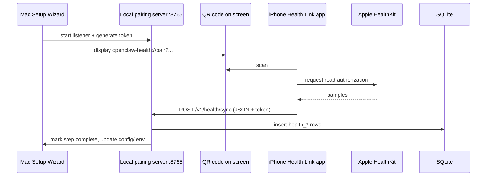

# Setup Wizard & Apple Health — Design (Mahesh Balan)

Design goals for deployment and repeatable onboarding:

1. One **Mac setup assistant** that shows completed steps and remaining work.
2. **FHIR MCP** — capture API key, first name, last name, and date of birth in **`config/.env`** (never version control).
3. **Apple Health** — primary path: **QR on Mac** → **iPhone HealthKit authorization** → **local HTTP API on the Mac** → **SQLite** (no dependency on exporting another app’s database).
4. After configuration, the operator starts **Ollama + OpenClaw** for **SQLite-grounded** MedGemma inference.

---

## Why there is no public “Apple Health REST API”

Apple does not expose HealthKit through a general-purpose cloud API for third parties. Supported integration patterns:

| Approach | Mac receives data | iPhone role | Notes |
| --- | --- | --- | --- |
| **A. Mac HealthKit** | Direct read from Health app (often synced from iPhone via iCloud) | Indirect | Useful when the Mac Health database is already populated |
| **B. QR + iOS companion (recommended)** | Local HTTP on Mac | Scan QR, authorize HealthKit, POST JSON | Decoupled from MyWellWallet; matches OpenClaw Health Link |
| **C. Full MyWellWallet app** | Export or app-specific API | Required | Shares research codebase but couples workflows |
| **D. File import / JSON inbox** | Manual or scripted drop | Optional | Secondary path for development and recovery |

**Recommended production narrative:** **B**, with **A** as an optional enhancement on macOS hosts that already sync Health data. **D** is documented only for engineering fallback.

---

## Architecture (QR + local API)



### Mac components (this repository)

| Component | Role |
| --- | --- |
| **`setup-wizard/`** | Tkinter UI: prerequisite checks, FHIR form, QR display, resumable state |
| **`apple-health-bridge/pairing_server.py`** | Local pairing API and token validation |
| **`scripts/apple_health_pairing.sh`** | CLI QR output for headless setups |

### iPhone component

**OpenClaw Health Link** ([`Health_Link_iOS/`](../../Health_Link_iOS/)):

1. Scan QR or open the universal / custom URL.
2. Parse `host`, `port`, `token`.
3. Request HealthKit read authorization (glucose, heart rate, steps, blood pressure, and related types).
4. Query samples (default window: last 90 days).
5. `POST http://<host>:<port>/v1/health/sync` with header `X-Pairing-Token: <token>` and a JSON body aligned with `health_sync.py`.

FHIR/EHR logic on the phone is not required for this sync path.

### URL scheme

```text
openclaw-health://pair?host=192.168.1.42&port=8765&token=<uuid>
```

HTTPS universal links are an alternative when operating a hosted pairing landing page.

---

## Setup Wizard user flow

1. Launch **`./scripts/run_setup_wizard.sh`**
2. **Prerequisites** — verify Node 24, Ollama, OpenClaw, Python; surface install guidance for missing components.
3. **Local database & SQLite MCP** — initialize schema and Python venv.
4. **FHIR MCP** — enter API key, first name, last name, DOB; persist to **`config/.env`**; optionally register MCP servers.
5. **Apple Health** — start pairing server, display QR, wait for iPhone POST; mark complete on success.
6. **Ollama / MedGemma** — pull model and apply OpenClaw configuration patch.
7. **Ready** — instructions for OpenClaw TUI and first-run synchronization prompts.

Progress file:

```text
~/.openclaw-health-assistant/setup_progress.json
```

Re-launching the wizard resumes at the first incomplete step.

---

## Future work: native SwiftUI setup application

A menu-bar or standalone SwiftUI application could provide:

- HealthKit-on-Mac ingestion (**Path A**) where entitlements allow.
- Embedded wizard steps with native QR rendering (`CoreImage`).
- Distribution as **OpenClaw Health Setup.app**.

The current Python wizard validates the workflow; a native shell can invoke the same scripts and pairing server.

---

## Security considerations

- Pairing tokens should be **short-lived** and scoped to the **local network** session.
- Bind the pairing server to a LAN address, or localhost with an explicit tunnel, in restricted environments.
- Do not commit **`.env`**, pairing tokens, or SQLite files containing PHI.
- FHIR MCP API keys are **per operator**, issued by an administrator through private channels.

---

## Implementation status

| Capability | Status |
| --- | --- |
| Setup Wizard (Tkinter) | Available — `setup-wizard/wizard.py` |
| Local pairing API | Available — `pairing_server.py` |
| QR in wizard | Available (requires `pip install qrcode[pil]`) |
| iOS Health Link | Available — [`Health_Link_iOS/`](../../Health_Link_iOS/) |
| Mac HealthKit direct ingest | Planned — native helper |

---

## Research rationale (summary)

1. **Local inference** (MedGemma via Ollama) keeps conversational reasoning on-device; remote FHIR MCP is an optional, authenticated data plane.
2. **MCP** standardizes tool access to SQLite and FHIR backends without embedding credentials in the model.
3. **QR pairing** establishes trust between phone and Mac; health payloads traverse **local Wi‑Fi**, not a multi-tenant social login.
4. **Resumable setup** reduces friction when operators fix a single failed step without repeating the full install sequence.
