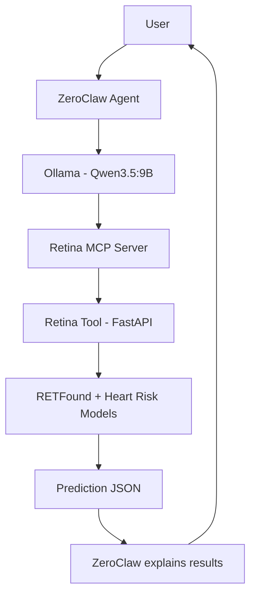
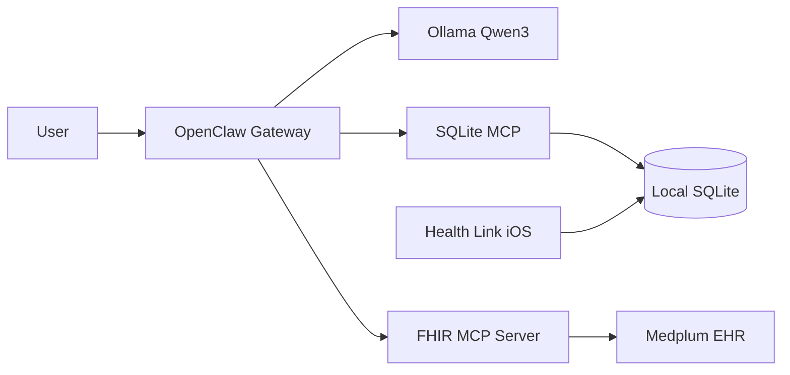

# OpenClaw Health Wallet (CGU-AI4Humanity)

**IST 362 — Advances in AI and Quantum Computing** · Claremont Graduate University · Doctor of Technology research

This repository documents how **OpenClaw-family local agents** (OpenClaw, ZeroClaw) plus **Ollama** can act as a **personal health companion** on your own machine—without sending conversations to frontier cloud models. Clinical and wearable data stay under your control; the agent uses **Model Context Protocol (MCP)** tools to read structured health records and explain them in plain language.

We showcase **two complementary implementations** in one monorepo:

| Track | Agent stack | Primary use case |
| --- | --- | --- |
| **ZeroClaw — Retinal Health Assistant** (Santanu Ray) | ZeroClaw + Ollama (Qwen) + custom Retina MCP | **Fundus / retinal image analysis** (RETFound retinal age, heart-risk screening) |
| **OpenClaw — Health Assistant** (Brandon Medina, Mahesh Balan, Leonard Bryant) | OpenClaw + Ollama (**Qwen 2.5 7B**) + **typed health MCP** + synthetic demo DB ([sqlite_plus_custom_mcp](./sqlite_plus_custom_mcp/)); optional Apple Health / FHIR legacy paths | **Natural-language Q&A** over **vitals & labs** (demo: `PT0001`) |

Both tracks share the same design idea: **local LLM for reasoning**, **MCP for tools**, **no requirement for GPT/Claude/etc. in the loop**.

---

## Overall objective

Modern health apps often depend on proprietary cloud AI. Here we show that:

1. A **local agent** (OpenClaw or ZeroClaw) can plan and call tools safely.
2. **Ollama** can run **medical-tuned or general open models** (MedGemma, Qwen, etc.) on consumer hardware.
3. **MCP servers** bridge the agent to **FHIR EHR data**, **local SQLite caches**, and **specialized models** (retinal CNNs via FastAPI).
4. **Context for answers** comes from **your data** (SQLite + synced FHIR + Apple Health tables), not from the model’s parametric memory.

The OpenClaw track aligns with the **[MyWellWallet](https://github.com/maheshbalan/myWellWallet)** iOS app and the **[FHIR MCP Server](https://github.com/maheshbalan/fhir-mcp-server)** gateway (hosted API: [mcp-fhir-server.com](https://mcp-fhir-server.com/)).

> **Medical disclaimer:** All projects here are **research prototypes**. They do not diagnose, treat, or replace care from licensed professionals.

---

## Implementation 1 — ZeroClaw retinal fundus assistant (Santanu Ray)

**Directory:** `Zero_Claw-Retina_Health-Assistant/`  
**Detailed guide:** [README_Retina_AI_Assistant.md](./Zero_Claw-Retina_Health-Assistant/README_Retina_AI_Assistant.md)

Specialized **screening-style** workflow: the user supplies a retinal image; ZeroClaw calls a **Retina MCP** server, which invokes a **FastAPI Retina Tool** running **RETFound** and a heart-risk model; Qwen on Ollama turns JSON results into a narrative explanation.



**When to use this track:** You have fundus images and want **local, MCP-orchestrated** retinal-age / cardiovascular-risk **screening** (experimental), not full EHR chat.

---

## Implementation 2 — OpenClaw personal health wallet (OpenClaw Health Assistant)

**Directory:** `Openclaw_Health_Assistant/` · iPhone companion: [`Health_Link_iOS/`](./Health_Link_iOS/)  
**Setup guide:** [Openclaw_Health_Assistant/README.md](./Openclaw_Health_Assistant/README.md)

**General health companion** on macOS: OpenClaw + **Qwen3** on Ollama for **MCP tool calling**, with optional **MedGemma** for non-tool chat:

- **Local SQLite** — same FHIR JSON schema as MyWellWallet (`fhir_patients`, `fhir_resources`, `health_*` tables).
- **SQLite MCP** — agent reads/writes the cache via audited tools (Brandon Medina).
- **FHIR MCP** — live fetch from the hosted gateway at [mcp-fhir-server.com](https://mcp-fhir-server.com/) ([source](https://github.com/maheshbalan/fhir-mcp-server)) (Leonard Bryant).
- **Apple Health** — iPhone **[Health Link](./Health_Link_iOS/)** app: QR pairing → local Mac API → SQLite (Mahesh Balan).



**Typical answer path:** User asks a question → OpenClaw pulls **context from SQLite** via MCP → **Qwen3** generates an answer grounded in that context. After a one-time sync, FHIR and Apple Health data live locally so you are not re-authenticating every turn.

**When to use this track:** You want **conversational access** to **your** records, vitals, and labs with a **local** medical LLM.

---

## FHIR MCP Server (shared backend)

The **[FHIR MCP Server](https://github.com/maheshbalan/fhir-mcp-server)** exposes MCP tools for FHIR CRUD, document RAG (Pinecone), LOINC lookup, and API-key–authenticated access at **[mcp-fhir-server.com](https://mcp-fhir-server.com/)**—the same gateway the [MyWellWallet](https://github.com/maheshbalan/myWellWallet) iPhone app uses. OpenClaw connects over **Streamable HTTP** with an **`X-API-Key`** header stored only in **local** `config/.env` (gitignored).

Patient identity for FHIR lookup (**first name, last name, date of birth**) is also stored in that local config so the agent does not repeatedly ask for credentials; see the OpenClaw guide.

---

## Attribution

| Researcher | Contribution |
| --- | --- |
| **Santanu Ray** | ZeroClaw retinal fundus assistant (`Zero_Claw-Retina_Health-Assistant/`) |
| **Mahesh Balan** | OpenClaw Health Assistant — project management, OpenClaw + MedGemma stack, Apple Health integration, MyWellWallet / FHIR alignment |
| **Brandon Medina** | OpenClaw Health Assistant — SQLite schema, database setup & testing, SQLite MCP server |
| **Leonard Bryant** | OpenClaw Health Assistant — MCP connections (local SQLite MCP + remote FHIR MCP in OpenClaw) |

OpenClaw subsystem details: [Openclaw_Health_Assistant/CONTRIBUTORS.md](./Openclaw_Health_Assistant/CONTRIBUTORS.md).

---

## Quick start (OpenClaw track)

```bash
git clone https://github.com/CGU-AI4Humanity/openclaw_health_wallet.git
cd openclaw_health_wallet/Openclaw_Health_Assistant
cp config/.env.example config/.env   # add API key + your name/DOB — never commit
./scripts/install_local_stack.sh
nvm use 24 && openclaw chat
```

Follow [Openclaw_Health_Assistant/README.md](./Openclaw_Health_Assistant/README.md) for Apple Health, FHIR MCP, first-run prompts, **`configure_qwen_tools.sh`**, and optional **MedGemma** / larger **tool-capable** models on high-RAM machines.

---

## Related work

- [MyWellWallet](https://github.com/maheshbalan/myWellWallet) — mobile personal health wallet (FHIR + local SQLite + MCP)
- [FHIR MCP Server](https://github.com/maheshbalan/fhir-mcp-server) — healthcare AI gateway (MCP tools, RAG, LOINC); hosted at [mcp-fhir-server.com](https://mcp-fhir-server.com/)

---

## License

Academic / research use unless otherwise noted in subproject folders. **Do not commit** API keys, `.env`, SQLite files with PHI, or Apple Health exports.
