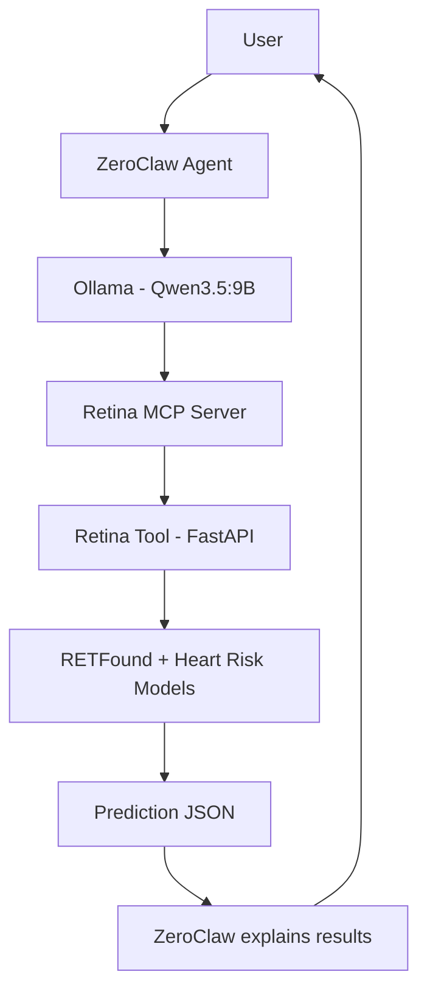

# AI-Powered Retinal Health Assistant

A fully local retinal-health assistant that combines:

- **ZeroClaw** for agent orchestration
- **Ollama** with **Qwen3.5:9B** for local reasoning and natural-language explanations
- **Model Context Protocol (MCP)** for standardized tool integration
- **FastAPI** for the Retina Tool API
- **Docker Compose** for local deployment
- **RETFound** for retinal-age estimation
- **Heart-risk model** for cardiovascular-risk screening

> **Medical disclaimer:** This project is an experimental AI screening system. It does not diagnose disease and must not replace evaluation by a qualified healthcare professional.

---

## Architecture



### Component responsibilities

| Component | Responsibility |
|---|---|
| User | Supplies the retinal image and asks for analysis |
| ZeroClaw | Manages conversation, selects tools, and coordinates the workflow |
| Ollama / Qwen3.5:9B | Understands the request and explains tool output |
| Retina MCP Server | Exposes retinal-analysis functions as MCP tools |
| Retina Tool | Performs the actual image inference through FastAPI |
| RETFound Model | Estimates retinal age |
| Heart-Risk Model | Estimates cardiovascular-risk probability and class |
| Prediction JSON | Carries structured model results back to ZeroClaw |

---

## Project Structure

```text
retina-assistant/
├── docker-compose.yml
├── shared-images/
│   └── test.jpg
├── retina-tool/
│   ├── Dockerfile
│   ├── app.py
│   ├── requirements.txt
│   └── models/
└── retina-mcp/
    ├── Dockerfile
    ├── requirements.txt
    └── server.py
```

---

## Runtime Flow

1. The user asks ZeroClaw to analyze a retinal image.
2. Qwen3.5:9B decides to call the Retina MCP tool.
3. The MCP server receives the image path.
4. The MCP server sends the image to the Retina Tool using `POST /predict`.
5. The Retina Tool runs the RETFound and heart-risk models.
6. The Retina Tool returns structured JSON.
7. ZeroClaw converts the JSON into a clear natural-language explanation.

---

## Prerequisites

Install the following on macOS:

- Docker Desktop
- Ollama
- ZeroClaw 0.8.x
- Qwen3.5:9B
- Node.js only if MCP Inspector is required

Verify:

```bash
docker --version
ollama --version
zeroclaw --version
```

Check the local Ollama model:

```bash
ollama list
```

Expected model:

```text
qwen3.5:9b
```

---

## Docker Compose

Example `docker-compose.yml`:

```yaml
version: "3.9"

services:
  retina-tool:
    build:
      context: ./retina-tool
    container_name: retina-tool
    ports:
      - "8000:8000"
    volumes:
      - ./shared-images:/shared-images
    restart: unless-stopped

  retina-mcp:
    build:
      context: ./retina-mcp
    container_name: retina-mcp
    ports:
      - "8001:8000"
    depends_on:
      - retina-tool
    environment:
      RETINA_URL: "http://retina-tool:8000/predict"
      RETINA_HEALTH_URL: "http://retina-tool:8000/health"
    volumes:
      - ./shared-images:/shared-images:ro
    restart: unless-stopped
```

---

## Retina MCP Server

Example `retina-mcp/server.py`:

```python
import os
from pathlib import Path
from typing import Any

import httpx
from mcp.server.fastmcp import FastMCP

RETINA_URL = os.getenv("RETINA_URL", "http://retina-tool:8000/predict")
RETINA_HEALTH_URL = os.getenv("RETINA_HEALTH_URL", "http://retina-tool:8000/health")

mcp = FastMCP(
    name="Retina MCP",
    stateless_http=True,
    json_response=True,
    host="0.0.0.0",
    port=8000,
)

@mcp.tool()
async def analyze_retina_image(image_path: str) -> dict[str, Any]:
    """
    Analyze exactly one retinal image.

    Use exactly the image_path supplied by the user.
    Never invent, modify, or retry with another image path.
    """
    image = Path(image_path).resolve()

    if not image.exists():
        return {"status": "error", "message": f"Image not found: {image_path}"}

    if not image.is_file():
        return {"status": "error", "message": f"Path is not a file: {image_path}"}

    content_types = {
        ".jpg": "image/jpeg",
        ".jpeg": "image/jpeg",
        ".png": "image/png",
    }

    content_type = content_types.get(image.suffix.lower())
    if content_type is None:
        return {"status": "error", "message": "Only JPG, JPEG, and PNG files are supported."}

    try:
        async with httpx.AsyncClient(timeout=120.0) as client:
            with image.open("rb") as image_file:
                files = {
                    "image": (
                        image.name,
                        image_file,
                        content_type,
                    )
                }
                response = await client.post(RETINA_URL, files=files)

        response.raise_for_status()
        return {"status": "success", "prediction": response.json()}

    except httpx.ConnectError:
        return {"status": "error", "message": "Could not connect to the Retina Tool."}
    except httpx.TimeoutException:
        return {"status": "error", "message": "Retina Tool request timed out."}
    except httpx.HTTPStatusError as exc:
        return {
            "status": "error",
            "message": f"Retina Tool returned HTTP {exc.response.status_code}: {exc.response.text}",
        }

@mcp.tool()
async def health() -> dict[str, Any]:
    """Check connectivity between MCP and the Retina Tool."""
    try:
        async with httpx.AsyncClient(timeout=10.0) as client:
            response = await client.get(RETINA_HEALTH_URL)
        response.raise_for_status()
        return {"status": "success", "retina_tool": response.json()}
    except Exception as exc:
        return {"status": "error", "message": str(exc)}

if __name__ == "__main__":
    mcp.run(transport="streamable-http")
```

---

## MCP Server Requirements

`retina-mcp/requirements.txt`:

```text
mcp[cli]
httpx
```

`retina-mcp/Dockerfile`:

```dockerfile
FROM python:3.11-slim
WORKDIR /app
COPY requirements.txt .
RUN pip install --no-cache-dir -r requirements.txt
COPY server.py .
EXPOSE 8000
CMD ["python", "server.py"]
```

---

## ZeroClaw Configuration

Homebrew ZeroClaw configuration path:

```text
/opt/homebrew/var/zeroclaw/config.toml
```

Example configuration:

```toml
schema_version = 3

[agents]

[agents.retina_assistant]
model_provider = "ollama.default"
runtime_profile = "unbounded"
risk_profile = "balanced"
mcp_bundles = ["retina_tools"]

[providers]
[providers.models]
[providers.models.ollama]

[providers.models.ollama.default]
uri = "http://localhost:11434"
model = "qwen3.5:9b"

[mcp]
enabled = true
deferred_loading = false

[[mcp.servers]]
name = "retina"
transport = "http"
url = "http://localhost:8001/mcp"
tool_timeout_secs = 180

[mcp_bundles.retina_tools]
servers = ["retina"]
```

The MCP tools appear in ZeroClaw as:

```text
retina__health
retina__analyze_retina_image
```

---

## Build and Start

### Start Docker Desktop

```bash
open -a Docker
```

Wait until Docker is ready:

```bash
until docker info >/dev/null 2>&1; do
  sleep 3
done
```

### Start Retina Tool and MCP Server

```bash
cd ~/retina-assistant
docker compose up -d
```

Check:

```bash
docker compose ps
```

---

## Validate Retina Tool

### Health check

```bash
curl -s http://localhost:8000/health | python3 -m json.tool
```

### Direct prediction

```bash
curl -s -X POST http://localhost:8000/predict \
  -F "image=@./shared-images/test.jpg" \
  | python3 -m json.tool
```

---

## Validate MCP Server

### List tools

```bash
curl -sN -X POST http://localhost:8001/mcp \
  -H "Content-Type: application/json" \
  -H "Accept: application/json, text/event-stream" \
  -d '{
    "jsonrpc": "2.0",
    "id": 1,
    "method": "tools/list",
    "params": {}
  }' | python3 -m json.tool
```

### MCP health call

```bash
curl -sN -X POST http://localhost:8001/mcp \
  -H "Content-Type: application/json" \
  -H "Accept: application/json, text/event-stream" \
  -d '{
    "jsonrpc": "2.0",
    "id": 2,
    "method": "tools/call",
    "params": {
      "name": "health",
      "arguments": {}
    }
  }' | python3 -m json.tool
```

### MCP retinal analysis call

```bash
curl -sN -X POST http://localhost:8001/mcp \
  -H "Content-Type: application/json" \
  -H "Accept: application/json, text/event-stream" \
  -d '{
    "jsonrpc": "2.0",
    "id": 3,
    "method": "tools/call",
    "params": {
      "name": "analyze_retina_image",
      "arguments": {
        "image_path": "/shared-images/test.jpg"
      }
    }
  }' | python3 -m json.tool
```

---

## Start Ollama

Check whether Ollama is already running:

```bash
curl -s http://localhost:11434/api/tags | python3 -m json.tool
```

If it is not running:

```bash
open -a Ollama
```

---

## Start ZeroClaw Chat

```bash
zeroclaw agent -a retina_assistant
```

Use this prompt:

```text
Call retina__analyze_retina_image exactly once with:

image_path="/shared-images/test.jpg"

Do not call any other tool.
Do not modify, infer, or invent another image path.

After receiving the tool result, summarize only:
- estimated retinal age
- heart-risk probability
- predicted class
- medical disclaimer
```

---

## Example Prediction

```json
{
  "filename": "test.jpg",
  "retinal_age": {
    "estimated_age_years": 53.02
  },
  "cardiovascular_screening": {
    "heart_risk_probability": 0.74288,
    "heart_risk_probability_percent": 74.29,
    "no_heart_risk_probability": 0.25712,
    "no_heart_risk_probability_percent": 25.71,
    "predicted_class": "heart_risk"
  },
  "device": "cpu",
  "disclaimer": "This is an experimental AI screening result. It does not diagnose heart disease and must not replace evaluation by a qualified healthcare professional."
}
```

---

## Start Everything After Reboot

```bash
open -a Docker

until docker info >/dev/null 2>&1; do
  sleep 3
done

cd ~/retina-assistant
docker compose up -d

curl -s http://localhost:8000/health | python3 -m json.tool
ollama list
zeroclaw status
zeroclaw agent -a retina_assistant
```

---

## Optional Startup Script

Create `~/start-retina-assistant.sh`:

```bash
#!/bin/bash
set -e

PROJECT_DIR="$HOME/retina-assistant"

open -a Docker
until docker info >/dev/null 2>&1; do
  sleep 3
done

cd "$PROJECT_DIR"
docker compose up -d

until curl -fsS http://localhost:8000/health >/dev/null 2>&1; do
  sleep 3
done

if ! curl -fsS http://localhost:11434/api/tags >/dev/null 2>&1; then
  open -a Ollama
  until curl -fsS http://localhost:11434/api/tags >/dev/null 2>&1; do
    sleep 3
  done
fi

zeroclaw agent -a retina_assistant
```

Make it executable:

```bash
chmod +x ~/start-retina-assistant.sh
```

Run:

```bash
~/start-retina-assistant.sh
```

---

## Troubleshooting

### Docker unavailable

```bash
open -a Docker
docker info
```

### Retina Tool returns HTTP 422

Use multipart field `image`, not `file`.

### MCP cannot find the image

```bash
ls -l ~/retina-assistant/shared-images/test.jpg

docker compose exec retina-mcp \
  ls -l /shared-images/test.jpg
```

### ZeroClaw invents another path

Use an explicit prompt and consider:

```toml
max_tool_iterations = 2
strict_tool_parsing = true
parallel_tools = false
```

### Logs

```bash
docker compose logs -f retina-tool
```

```bash
docker compose logs -f retina-mcp
```

---

## Security and Privacy Recommendations

- Keep services bound to localhost unless remote access is intentionally secured.
- Mount `shared-images` as read-only in the MCP container.
- Delete retinal images after processing when retention is unnecessary.
- Do not log raw medical images or personally identifiable information.
- Add authentication before exposing APIs beyond the MacBook.
- Encrypt stored images and prediction outputs if persistence is added.
- Always include the medical disclaimer in user-facing responses.

---

## Current Validation Status

- [x] Retina Tool health endpoint
- [x] Direct Retina Tool prediction
- [x] MCP tool discovery
- [x] MCP health tool
- [x] MCP retinal-analysis tool
- [x] Shared-volume image access
- [x] ZeroClaw MCP discovery
- [x] Ollama Qwen3.5:9B integration
- [x] End-to-end natural-language response
- [ ] Browser image-upload interface
- [ ] Grad-CAM explainability visualization
- [ ] Longitudinal analysis database
- [ ] PDF report generation

---

## Future Enhancements

- Browser-based chat with image upload
- Grad-CAM retinal heatmaps
- User authentication
- Secure temporary-image handling
- Historical result comparison
- PDF clinical-style report generation
- Model confidence calibration
- Audit logging
- Human-in-the-loop clinical review

---

## Author

**Santanu Ray**

Doctor of Technology research prototype focused on local AI agents, MCP-based tool integration, retinal-image analysis, and privacy-preserving AI workflows.
